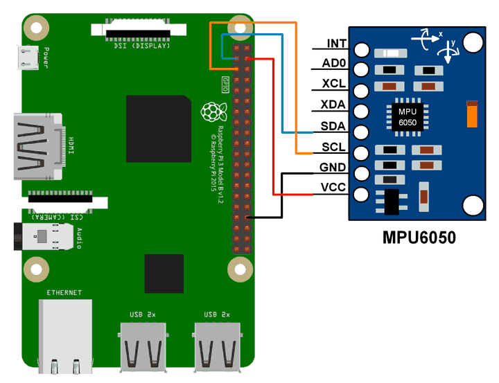

# MPU6050 Driver

A C++ driver for the MPU6050 6-axis IMU (accelerometer + gyroscope), written for Linux/Raspberry Pi. Includes a hardware abstraction layer for I2C, a demo application that computes roll/pitch/yaw, and a full unit tests.

## Hardware

- MPU6050 connected via I2C to `/dev/i2c-1`
- Tested on Raspberry Pi (ARM64)



## Building

Requires [Bazel](https://bazel.build/).

```bash
# Build the executable
bazel build //:mpu_driver

# Run unit tests
bazel test //:mpu6050_test

# Run the demo (requires MPU6050 on /dev/i2c-1)
./bazel-bin/mpu_driver
```

## Usage

```cpp
LinuxI2CBus bus("/dev/i2c-1");
MPU6050_Interface imu(&bus);

imu.Initialize();
imu.SetAccelRange(0);   // ±2g
imu.SetGyroRange(0);    // ±250 °/s
imu.SetDLPF(3);
imu.Calibrate();        // keep sensor stationary

IMU_Data data;
imu.Read(&data);        // data.ax, data.ay, data.az, data.gx, data.gy, data.gz, data.temp
```

## API

| Method | Description |
|---|---|
| `Initialize()` | Wake chip and verify identity (WHO_AM_I) |
| `SetAccelRange(0–3)` | ±2g / ±4g / ±8g / ±16g |
| `SetGyroRange(0–3)` | ±250 / ±500 / ±1000 / ±2000 °/s |
| `SetSampleRate(0–255)` | SMPLRT_DIV register value |
| `SetDLPF(0–6)` | Digital low-pass filter config |
| `Calibrate()` | Average 500 samples and write offset registers |
| `Read(IMU_Data*)` | Read scaled accel, gyro, and temperature |
| `Sleep()` / `Wake()` | Power management |

## Error Handling

All methods return a `DriverStatus` enum:

```cpp
enum class DriverStatus : uint8_t {
    OK, ERR_NULL_BUS, ERR_I2C_READ, ERR_I2C_WRITE,
    ERR_BAD_PARAM, ERR_BAD_DATA, ERR_VERIFY_FAILED, ERR_NOT_INIT
};
```

## Project Structure

```
src/
  headers/
    I2CBus.h          # Abstract I2C interface
    MPU6050.h         # Driver class
    LinuxI2CBus.h     # Linux i2c-dev implementation
    TestI2CBus.h      # Mock for unit testing
    status.h          # Error codes
  MPU6050.cpp
  LinuxI2CBus.cpp
  main.cpp            # Demo application
tests/
  mpu6050_test.cpp    # Google Test unit tests
```
